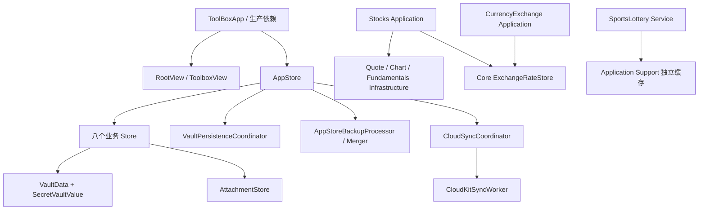

# MyTools 当前架构复审

复审日期：2026-08-22
审查范围：`MyTools` 当前生产代码、`MyToolsTests`、Xcode Target 装配、README/AGENTS 文档。统计以当前工作树和 `git ls-files` 为准；工作树中已有的未提交改动不在本次复审中回滚。

## 结论摘要

MyTools 是一个 SwiftUI 多平台、单 App Target 加单 Test Target 的本地优先个人工具箱。工程登记九个工具：金融账户、股票投资、换汇记录、健康档案、美食地图、保密资料、证照、收支账单八个本地业务模块，以及不写入 Vault/备份/CloudKit 的体彩开奖赛果缓存模块；赛事选择和比赛顺序属于应用偏好，仍可参与偏好同步。

当前分层已经基本形成高内聚、低耦合的结构：业务数据和确定性规则在 `Features/<Module>/Domain`，模块状态和用例在 `Application`，外部接口及磁盘缓存在 `Infrastructure`，SwiftUI 页面在 `Presentation`；跨模块能力集中在 `Core`，根组合集中在 `App`。Feature 之间没有发现直接持有彼此 Store、View 或具体服务的依赖。

但不能把当前结构描述为“没有架构风险”。最高优先级是备份范围与首页显隐耦合、产品语义仍需明确；其次是 `AppStore` 仍承载过多跨模块治理逻辑，偏好同步还通过无类型约束的 `NotificationCenter` 回传，单 Target 也无法在编译期阻止目录边界被破坏。它们不要求立即大规模重构，但应在下一轮迭代中处理或用测试锁定取舍。

| 优先级 | 发现 | 当前判断 |
| --- | --- | --- |
| P1 | 备份范围与首页显隐耦合 | 已确认为产品契约（2026-08-27）：隐藏模块不参与加密备份，`AppStoreFacadeTests.hiddenModuleIsExcludedFromBackup` 锁定该行为；与 CloudKit 参与范围的差异已在 `AGENTS.md` 不可破坏规则中写明。 |
| P2 | `AppStore` 责任面偏宽 | 约 1046 行，除组合/持久化/同步外，还包含模块数据删除撤回和清理策略；附件引用遍历已抽出为 `ModuleAttachmentReferenceIndex.swift`（`App/Composition/`）。删除/撤回状态机仍在 `AppStore`，本项部分完成。 |
| P2 | 应用偏好变更使用全局通知 | 已处理：偏好变更改由 `AppPreferenceChangeBus` 汇聚，`ToolModuleSettings`/`StockAppearanceSettings` 等提供类型化回调，不再列为未解决项。 |
| P2 | 单 Target 只能靠约定隔离 | 编译条件能裁剪模块，但不能阻止任意 Feature 访问另一个 Feature 的 internal 类型；当前依赖禁令依赖审查和测试。 |
| P3 | 少数展示文件过大 | `SecretVaultView` 约 1318 行、`BankAccountViews` 约 1236 行、股票图表展示链约 1100 行。它们仍以单一用户流程为主，但已经是后续冲突和测试困难的主要位置。 |
| P3 | `@unchecked Sendable` 和进程级单例较多 | `VaultData`、`AttachmentStore`、存储服务及多个协调器跨并发边界运行；目前有明确调用边界，`VaultPersistenceCoordinator` 的并发 `schedule` 已有回归测试（`SecureStoreEncryptionTests.concurrentScheduleFlushesWithoutErrorsAndPersistsEncryptedVault`），应继续用并发测试和集中构造限制风险。 |

## 工程规模与边界

当前统计：

- 生产 Swift 文件 160 个，约 48,478 行。
- 测试/测试支持 Swift 文件 32 个，约 7,892 行。
- 测试中有 248 个 `@Test` 声明、998 个 `#expect` 断言。
- Xcode 工程包含 `MyTools` 和 `MyToolsTests` 两个 Target，以及共享 `MyTools` Scheme。
- 当前没有第三方 Swift Package，也没有独立 Swift Package 或 framework 提供模块级访问控制。

### 逻辑模块

| 层 | 当前目录 | 所有权 |
| --- | --- | --- |
| App 启动与组合 | `MyTools/App/Bootstrap`、`Composition`、`Modules`、`Navigation`、`Settings` | 生产依赖、根状态、模块注册、导航和全局设置 |
| Core | `MyTools/Core` | 附件、认证、备份、CloudKit、汇率、日志、通知、OCR、持久化、存储和通用 UI |
| Feature | `MyTools/Features/<Module>` | 八个业务模块与体彩缓存模块的领域、用例、外部接口和页面 |
| Tests | `MyToolsTests` | 按 AppStore、Core、Feature、Store 和 TestSupport 分组的回归测试 |

业务模块的编译可用性唯一来自 `Config/Shared.xcconfig` 的 `MYTOOLS_ENABLE_*`，汇总为 `MYTOOLS_COMPILED_FEATURES`。`ToolModule.swift` 是模块能力、备份参与和 CloudKit 参与的注册源；`ToolModuleSettings.swift` 只保存首页显隐、顺序及偏好。

## 当前产品与数据流



本地 Vault 是离线事实源：`SecureStore` 读写 `Application Support/MyTools/local-vault.json`，`VaultPersistenceCoordinator` 在 utility 队列串行合并保存。附件元数据进入业务记录，实际文件由 `AttachmentStore` 存放在附件目录；行情图、体彩赛果、汇率、诊断日志和 CloudKit 同步状态属于缓存或设备状态，不进入业务 Vault。

CloudKit 使用 `CloudSyncSnapshotBuilder` 的实体白名单按记录增量同步，业务 JSON 放入 CloudKit 加密字段，附件使用 `CKAsset`。隐藏首页模块仍参与 CloudKit；“删除功能数据”的撤回窗口才会临时从同步参与集合中移除目标模块。体彩的赛事和比赛顺序偏好进入应用偏好同步，赛果缓存本身不上传。

## 内聚性检查

### 做得较好的部分

1. **模块状态所有权清晰。** `StockStore`、`HealthStore`、`FinanceStore`、`FoodMapStore`、`SecretStore`、`DocumentsStore`、`BillsStore` 和 `CurrencyExchangeStore` 各自持有本域数组、规范化和修改入口；页面通过对应 `EnvironmentObject` 观察，不直接写文件。
2. **领域规则已经从页面剥离。** 股票交易校验、技术指标、组合统计、医疗草稿校验、证照有效期、账单分析、OCR 解析等规则位于 Domain 或可独立测试的 Application 类型。
3. **外部系统边界明确。** 股票报价、图表、基本面和体彩接口位于 Infrastructure；Core OCR、地图搜索、附件、通知和 CloudKit 通过协议或专用服务隔离。
4. **根 Store 已不再拥有业务 CRUD。** `AppStore` 的正常职责是装配 Store、加载/保存 Vault、备份合并、CloudKit 变更应用和模块生命周期协调；模块 CRUD 保留在 Feature Store。
5. **跨模块共享能力没有落入某个 Feature。** 币种/汇率、附件、认证、OCR、通知、输入和存储统计都位于 Core；股票和换汇只通过 `ExchangeRateStore` 共享汇率状态。
6. **详情/编辑页的"标签+值"行已统一。** 证照、保密资料、金融、健康、美食、账单、换汇、股票八个模块此前各自实现了结构相同但细节不一致的展示行/编辑行（部分甚至缺少 `lineLimit`，导致长文本换行撑高单行），现已统一收敛到 `Core/UI/FormRowComponents.swift` 的 `DetailValueRow`/`FieldEditorRow`/`DateFieldRow`/`PickerFieldRow`/`NumericFieldRow` 五个组件，Core 里旧的 `CopyableValueRow`/`ProtectedValueRow` 已随之移除；原生 `Picker` 不遵循 `defaultMinListRowHeight` 导致的裸 Picker 行矮于其它行的问题，通过 `PickerFieldRow` 强制外层高度解决。
7. **行高/间距常量改为字体驱动的计算属性，不再是固定磅值。** `AppListMetrics.minimumRowHeight`/`rowVerticalInset`/`recordContentSpacing` 从 `static let` 改为 `static func(fontScale:)`，以当前系统 body 字体行高为基准（iOS 走 Dynamic Type，macOS 走 App 自身的 `appFontScale`）乘以系数计算，叠加一个全局 `AppListMetrics.densityScale` 供统一微调；`IMESafeUITextField`/`IMESafeMultilineTextField` 的固定像素高度（原 34pt/84pt/220pt）同样改为按实际字体行高计算，避免大字号下输入框内容被裁切。这一变化影响所有引用这些常量的调用点，均已同步改为传入 `@Environment(\.appFontScale)` 读到的 `fontScale`。

### 仍需关注的部分

- `AppStore.swift` 中的模块数据删除流程从确认、快照、撤回到附件/通知/缓存最终清理，和 CloudKit/持久化协调交织在一起。建议下一轮把“模块删除状态机”和“附件引用索引”提为 App Composition 内部协作者，保留 AppStore 做流程编排。
- `Core/UI/ListViewModifiers.swift` 同时承载标签解析、Flow Layout、左滑规范、Sheet、可读宽度和诊断 modifier。它们都属于跨页面 UI 规范，但后续若标签能力或列表动作需要独立测试，可以拆成 `TagSupport` 与 `ListPresentation` 两个 Core 文件。
- `StockInvestmentScoreModel.swift` 虽接近千行，但所有内容围绕版本化评分、覆盖度和解释输出，暂不应按因子机械拆分；应优先保持模型版本测试。
- `SecretVaultView`、`BankAccountViews` 和股票看盘页面包含多个编辑/查看子流程。它们的下一次拆分触发条件应是子流程独立测试、独立权限语义或多人频繁并行修改，而不是单纯行数。

## 低耦合检查

### 已形成的依赖方向

```text
Presentation -> Application -> Domain
Presentation -> Core UI / Authentication / Attachments
Application -> Domain / Core / Infrastructure protocol
Infrastructure -> external system + Domain value objects
App -> all modules (composition root only)
```

- Feature 之间没有直接引用对方 Store、View 或具体 Provider。
- `VaultMutationNotifying` 是模块 Store 到 `AppStore` 的窄回调，使用弱引用，避免根 Store 与模块 Store 形成持有环。
- `AppStoreDependencies`、`VaultPersisting`、`VaultBackupProcessing`、`StockQuoteRefreshing`、`LocalNotificationScheduling` 等协议为测试替身提供了边界。
- CloudKit 合并按 `CloudSyncEntityKind` 显式分派，新增字段不会因为进入 `VaultData` 就自动上传。

### 具体耦合风险

1. **备份和首页显隐共用一条判断。** `AppStore.makeBackupDocument()` 使用 `moduleSettings.isVisible`，而 `makeCloudSyncSnapshot()` 使用 `ToolModuleCatalog.cloudSyncModules`（删除功能数据的撤回窗口会临时移除目标模块）。该差异已确认为产品契约（隐藏不备份、隐藏仍同步），由 `AppStoreFacadeTests.hiddenModuleIsExcludedFromBackup` 锁定，不再需要分离范围策略。
2. **偏好同步靠无类型通知。** `Notification.Name.syncedAppPreferenceDidChange` 是全局字符串事件，发送方不会声明具体偏好，接收方只能重新扫描整个偏好快照。建议以后让 `ToolModuleSettings`、排序设置和体彩偏好统一通过 `CloudSyncPreferencesBridge` 的变更回调汇聚。
3. **单 Target 没有编译期防线。** 目录约束和 `#if MYTOOLS_FEATURE_*` 能控制产品变体，但 Feature internal 符号仍可被其他 Feature 访问。若团队规模或模块数量继续增长，应考虑 Swift Package/Framework；在此之前维持依赖审查脚本或测试。
4. **设备级单例需要继续收口。** `DiagnosticLogger.shared`、`AppNotificationService.shared`、行情/体彩刷新协调器和部分缓存服务是合理的进程级对象，但业务 Store 不应直接创建或读取它们的内部状态。生产绑定应继续集中在 `LiveAppDependencies` 和 App 启动层。
5. **并发边界使用了 `@unchecked Sendable`。** `CloudSyncSnapshotBuilder`、备份处理和附件服务把 `VaultData`/`AttachmentStore` 交给后台任务；当前调用路径避免了 UI 直接并发修改，但需要继续用独立的序列化测试证明文件操作和快照采集不会交叉覆盖。

## 备份、同步与安全边界

| 能力 | 当前实现 | 边界 |
| --- | --- | --- |
| 本地档案 | `SecureStore` + `VaultPersistenceCoordinator` | JSON 明文业务载荷；iOS 使用系统文件保护；读取失败时禁止空档案覆盖原文件 |
| 加密备份 | `VaultBackupCrypto` | PBKDF2-HMAC-SHA256，210,000 rounds，256 位密钥，AES-GCM，格式 `1.0` |
| 备份范围 | `AppStore` -> `AppStoreBackupProcessor` | 当前导出/导入只包含已编译且首页可见模块；按记录 ID 增量合并，不清除未包含模块 |
| CloudKit | `CloudSyncCoordinator` + `CloudKitSyncWorker` | 私有数据库、自定义 Zone、记录级增量、远端删除和账户变化；默认关闭 |
| 缓存 | `StockChartDiskStore`、`SportsLotteryService`、`ExchangeRateRepository` | 可重建，独立于 Vault；行情/赛果/同步状态/诊断日志标记为不参与系统备份 |
| 敏感信息 | `AuthManager`、`SensitiveAccessView`、`ProtectedContent` | UI 遮罩和独立查看认证；本地 Vault 与附件仍无应用层静态加密；管理员摘要为无盐 SHA-256 |

需要特别区分三个概念：编译模块（由 `MYTOOLS_COMPILED_FEATURES` 决定）、首页可见模块（由 `ToolModuleSettings` 决定）和 CloudKit/备份参与模块（由 `ToolModuleCatalog` 加当前流程分别决定）。它们不能在文档或新代码中混称为“已开启模块”。

## 测试与验证

现有测试覆盖了：模块 Store 生命周期和冗余字段清理、账单分析/OCR/交换协议、证照有效期/OCR/附件/通知、健康编辑与关联同步、美食地图/附件/导航、保密资料导入、股票报价/图表/缓存/技术指标/评分、备份处理/合并、CloudKit 合并和 OCR Core。

本次执行：

- `xcodebuild -list -project MyTools.xcodeproj` 成功识别两个 Target 和共享 Scheme。
- `xcodebuild test -project MyTools.xcodeproj -scheme MyTools -destination 'platform=macOS' -derivedDataPath /tmp/MyTools-Codex-DerivedData CODE_SIGNING_ALLOWED=NO` 成功编译并链接 App/Test bundle，但测试运行阶段因当前沙箱无法连接 `testmanagerd` 失败；因此不能据此声称测试通过。
- `git diff --check` 无空白错误。

当前缺口：没有针对“隐藏模块导出备份范围”的根 Store 回归测试；偏好通知只验证行为，没有类型化事件契约；跨平台 UI、真实签名 CloudKit、附件并发写入和模块裁剪构建仍需要设备/CI 验证。

## 建议迭代顺序

1. 先决定隐藏模块是否应进入备份。若应进入，分离 `backupModules` 与 `visibleModules`，让导出/导入使用编译且允许备份的模块，并补隐藏模块、附件和未编译不透明数据测试；若不应进入，保留当前代码并把“隐藏模块不进入备份”作为产品契约。
2. 将 `AppStore` 的模块删除状态机和附件引用索引提为内部协作者，降低根 Store 的变化原因数量，不改变外部 API。
3. 将偏好写入统一收口到一个可注入的偏好状态对象或明确的 Bridge 回调，逐步减少 `NotificationCenter` 的全局字符串事件。
4. 增加自动依赖检查：禁止 `Features/<A>` 引用 `Features/<B>`，检查新增文件是否进入 Xcode Target，并在 CI 构建至少一个裁剪模块变体。
5. 大型 UI 文件按独立权限/流程/测试边界渐进拆分，同时保持 Domain/Application 不回流到 View。

## 维护规则

本文是当前架构判断，不是逐文件 API 索引。目录、文件职责和可复用能力以 `AGENTS.md` 为准，产品行为以 `README.md` 为准，源码和测试优先级最高。新增、移动或删除文件后，应先更新 `AGENTS.md`，再在本文件只记录会改变依赖方向、持久化边界或风险判断的架构变化。

## 后续变更记录

### 2026-08-27：P0 安全边界修复与 P1 备份契约确认

- **本地 Vault 静态加密落地**：`SecureStore` 新增 AES-GCM 加密信封（`VaultCrypto`，格式 2.0），随机 256 位密钥由 `KeychainVaultEncryptionKey` 保存在 Keychain（`WhenUnlockedThisDeviceOnly`，仅本机、不可迁移）。旧版明文档案在首次读取后立即原地升级为加密格式；Keychain/加密原语不可用时降级为明文读写并记录诊断，保证不丢数据；解密失败、密钥缺失、格式不受支持时沿用"禁止空档案覆盖原文件"的失败保护（`canPersist=false`）。附件文件仍为明文，尚未加密。
- **管理员密码摘要加盐**：`AuthManager` 改用 `AdminPasswordHash` 的加盐 PBKDF2-HMAC-SHA256（210,000 轮，恒定时间比较）；旧版无盐 SHA-256 摘要在验证成功后自动迁移。备份加密的 PBKDF2 派生改为复用 `VaultCrypto.pbkdf2SHA256`，消除第二套派生实现。
- **备份范围契约确认**：隐藏模块不参与加密备份（保持原行为），作为产品契约由 `AppStoreFacadeTests.hiddenModuleIsExcludedFromBackup` 锁定，与 CloudKit 参与范围（隐藏仍同步）的区别在 `AGENTS.md` 不可破坏规则中明确。
- **遗留风险不变**：附件静态加密、单 Target 隔离、`AppStore` 职责偏宽、偏好同步无类型事件等仍按上表优先级待处理；本地 Vault 加密后，`.mytools` 加密备份是 Keychain 密钥丢失时的唯一恢复路径，升级引导应在版本更新中提示用户先导出备份。

### 2026-08-27：CI 决策与并发回归补充

- **不配置 GitHub CI**：仓库未连接远端、当前不做远程 CI，因此不配置 GitHub Actions；本轮改动已由本地 `xcodebuild build-for-testing` 与 focused tests 覆盖验证。
