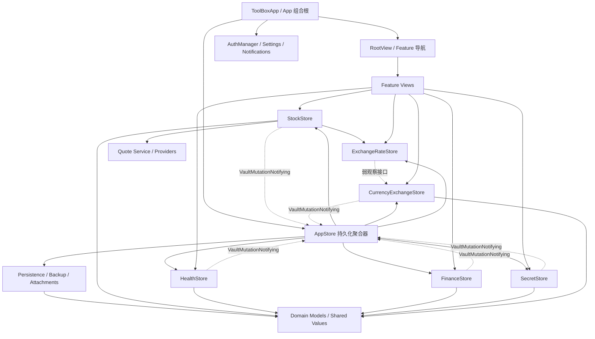

# MyTools 高内聚低耦合架构复审

复审日期：2026-08-07  
审查范围：`MyTools` 全部生产 Swift 代码、`MyToolsTests` 及 Xcode Target 装配。  
当前规模：110 个生产 Swift 文件、24,599 行；25 个测试/测试支持文件、2,958 行；89 个 `@Test` 声明。行数由 `wc -l` 统计，包含空行与注释。

> 工程目前仍是一个 App Target 加一个 Test Target。本文中的“模块”是按目录、状态所有权和依赖方向形成的逻辑模块；尚未由 Swift Package 或 framework 在编译期强制隔离。

## 结论摘要

上一版报告识别出的最高风险已经处理完成：`AppStore` 不再是跨五个业务域的上帝类。它由约千行收缩到 278 行，只装配六个模块 Store、协调初始加载、聚合持久化快照及执行备份恢复；Feature 页面分别观察自己的模块 Store。

当前没有需要立即继续拆分的高风险问题。剩余风险主要是单 Target 无法强制目录边界、少数大型 SwiftUI 页面仍有多个子流程，以及诊断日志等合理的进程级共享状态。继续拆分应以“独立变化原因或可独立测试的规则”为触发条件，不按行数机械拆 Section。

| 等级 | 问题 | 当前状态 |
| --- | --- | --- |
| 高 | 根 Store 跨五域发布状态和 CRUD | 已解决：六个模块 Store 独立持有状态，根 Store 只有 3 个发布状态。 |
| 高 | 根 Store 与刷新器、通知服务的具体类型耦合 | 已解决：窄协议注入，生产绑定只在组合根。 |
| 高 | 健康模块关闭启动后重开不补同步 | 已解决并有根 Store、模块 Store 两层回归测试。 |
| 中 | 附件基础仓库直接遍历健康、金融、秘密模型 | 已解决：领域映射归入备份处理器，`AttachmentStore` 只处理单文件。 |
| 中 | `Core <-> Models` 目录层次环 | 已解决：`CurrencyCode`、`FileAttachment` 移入 `Models/Shared`。 |
| 中 | 大型列表、详情和设置页面互相混杂 | 主要边界已拆；剩余大文件按真实变化边界观察。 |
| 中 | 单 Target 仅靠约定保持边界 | 保留；准备复用或多人并行开发时再物理模块化。 |
| 低 | 全局诊断、通知和方向状态 | 写入口已收口；继续控制读取和新增单例。 |

## 第一步：结构梳理

### 1.1 逻辑模块

| 模块 | 文件数 | 职责 |
| --- | ---: | --- |
| App/组合根 | 6 | 生命周期、根导航、模块目的地和生产依赖装配。 |
| Core | 15 | 附件、认证、备份、汇率、诊断、通知、持久化和存储扫描。 |
| Features | 32 | 各业务功能的 SwiftUI 页面与展示状态。 |
| Models | 11 | 领域实体、共享值对象、交易日历、组合统计和格式化。 |
| Services | 37 | 模块 Store、业务规则、行情 Provider/缓存/刷新和备份编排。 |
| Settings | 3 | 模块开关、顺序、外观和股票颜色设置。 |
| Shared | 6 | 跨 Feature 的输入、解析、格式化和 View modifier。 |

### 1.2 全部生产文件与职责

#### App 与组合根

| 文件 | 类型/职责 |
| --- | --- |
| `MyTools/ToolBoxApp.swift` | `ToolBoxApp`、`ConfiguredRootView`、iOS 方向控制；创建并注入根对象。 |
| `MyTools/App/AppMetadata.swift` | Bundle、后台任务、备份类型和偏好键常量。 |
| `MyTools/App/LiveAppDependencies.swift` | 将生产实现绑定到窄协议并构造 `.live` 依赖。 |
| `MyTools/App/RootView.swift` | 根导航、宽窄布局、生命周期提示和持久化 flush。 |
| `MyTools/App/ToolModuleDestination.swift` | 首页模块到 Feature 页面目的地的映射。 |
| `MyTools/App/ToolboxView.swift` | 根据模块设置生成工具首页入口。 |

#### Core

| 文件 | 类型/职责 |
| --- | --- |
| `MyTools/Core/Attachments/AttachmentEditSession.swift` | 编辑期新增/改名附件的提交与回滚状态机。 |
| `MyTools/Core/Attachments/AttachmentPresentation.swift` | 附件预览、分享和平台适配。 |
| `MyTools/Core/Attachments/AttachmentStore.swift` | 单个附件的导入、读写、定位、改名和删除。 |
| `MyTools/Core/Authentication/AdminModeViews.swift` | 管理员入口、状态指示和 modifier。 |
| `MyTools/Core/Authentication/AuthManager.swift` | 管理员密码、认证状态、会话锁定和密码迁移。 |
| `MyTools/Core/Authentication/AuthenticationView.swift` | 管理员认证 Sheet 与表单。 |
| `MyTools/Core/Authentication/SensitiveAccessView.swift` | 敏感内容访问门禁容器。 |
| `MyTools/Core/Backup/VaultBackup.swift` | 备份文档、Payload 和 AES-GCM 加解密。 |
| `MyTools/Core/Currency/ExchangeRateRepository.swift` | 汇率缓存读取、远程获取和落盘。 |
| `MyTools/Core/Currency/ForeignExchangeRateService.swift` | 中国银行外汇牌价请求与解析。 |
| `MyTools/Core/Diagnostics/DiagnosticLogger.swift` | 诊断事件、缓冲、文件轮转、导出和 flush。 |
| `MyTools/Core/Notifications/AppNotificationService.swift` | 通知授权、本地通知和规则去重状态。 |
| `MyTools/Core/Persistence/SecureStore.swift` | 本地 Vault 文件读写及异步合并保存协调。 |
| `MyTools/Core/Persistence/VaultData.swift` | 全业务持久化聚合根及兼容解码。 |
| `MyTools/Core/Storage/StorageUsageService.swift` | 占用统计、缺失/孤立附件扫描与清理。 |

#### Models

| 文件 | 类型/职责 |
| --- | --- |
| `MyTools/Models/BankCard.swift` | 银行、账户、子账户、卡片和账单聚合。 |
| `MyTools/Models/CurrencyExchange.swift` | 换汇记录、报价方向、损益和领域格式化。 |
| `MyTools/Models/HealthRecord.swift` | 医疗机构、就诊、费用和体检聚合。 |
| `MyTools/Models/NotificationRule.swift` | 股票与汇率提醒规则。 |
| `MyTools/Models/Secret.swift` | 秘密分类、字段和秘密条目。 |
| `MyTools/Models/Shared/CurrencyCode.swift` | 跨域币种值对象及显示顺序。 |
| `MyTools/Models/Shared/FileAttachment.swift` | 跨域附件值对象及内容类型。 |
| `MyTools/Models/Stock.swift` | 股票、交易、分红和持仓实体。 |
| `MyTools/Models/StockMarketTradingCalendar.swift` | A/港/美股交易日与交易时段规则。 |
| `MyTools/Models/StockPortfolioAnalytics.swift` | 跨持仓汇总和市场分配快照。 |
| `MyTools/Models/StockValueFormatter.swift` | 股票价格、数量、金额和百分比格式化。 |

#### Settings 与 Shared

| 文件 | 类型/职责 |
| --- | --- |
| `MyTools/Settings/StockAppearanceSettings.swift` | 各市场涨跌颜色偏好。 |
| `MyTools/Settings/ToolModule.swift` | 首页模块标识、标题、图标和顺序。 |
| `MyTools/Settings/ToolModuleSettings.swift` | 模块显隐/排序及全局外观、字号偏好。 |
| `MyTools/Shared/AppDateFormatting.swift` | 跨页面日期格式化。 |
| `MyTools/Shared/DecimalTextParser.swift` | 十进制文本与四则表达式解析。 |
| `MyTools/Shared/IMETextInput.swift` | iOS/macOS 输入法安全文本控件和输入诊断。 |
| `MyTools/Shared/ListViewModifiers.swift` | 列表排序、间距和导航展示 modifier。 |
| `MyTools/Shared/MarkdownRendering.swift` | Markdown 展示与链接处理。 |
| `MyTools/Shared/ProtectedContent.swift` | 敏感值显示、复制保护和跨平台 Toast。 |

#### Services：应用与领域

| 文件 | 类型/职责 |
| --- | --- |
| `MyTools/Services/AppStore.swift` | 模块装配、初始加载、持久化快照和备份恢复协调。 |
| `MyTools/Services/AppStoreAlertEvaluator.swift` | 纯函数计算应触发的股票/汇率提醒。 |
| `MyTools/Services/AppStoreBackupMerger.swift` | 按备份所含模块合并本地与导入数据。 |
| `MyTools/Services/AppStoreBackupProcessor.swift` | 模块裁剪、领域附件映射和备份加解密编排。 |
| `MyTools/Services/AppStoreDependencies.swift` | 根 Store 与模块 Store 所需的窄能力协议和依赖容器。 |
| `MyTools/Services/ModuleStoreContracts.swift` | 模块变更通知和汇率更新观察接口。 |
| `MyTools/Services/StockStore.swift` | 股票、交易、分红、提醒和报价刷新状态。 |
| `MyTools/Services/ExchangeRateStore.swift` | 股票与换汇共用的汇率状态和刷新生命周期。 |
| `MyTools/Services/HealthStore.swift` | 健康记录、机构同步和健康附件用例。 |
| `MyTools/Services/FinanceStore.swift` | 银行账户、卡片、账单附件和金融 CRUD。 |
| `MyTools/Services/SecretStore.swift` | 秘密 CRUD、附件和恢复期间写保护。 |
| `MyTools/Services/CurrencyExchangeStore.swift` | 换汇记录、汇率提醒和触发后关闭。 |
| `MyTools/Services/HealthRecordSynchronizer.swift` | 住院日记录、机构资料和分类同步规则。 |
| `MyTools/Services/MedicalRecordDraftValidator.swift` | 医疗编辑草稿的规范化、费用分配和校验。 |
| `MyTools/Services/StockPortfolioEditor.swift` | 股票、交易、分红的校验式增删改。 |
| `MyTools/Services/StockTechnicalAnalysis.swift` | MA、布林、MACD、RSI 等技术指标计算。 |
| `MyTools/Services/StockInvestmentScoreModel.swift` | 版本化非线性投资价值评分与因子解释。 |
| `MyTools/Services/StockRefreshCoordinator.swift` | 前台轮询、收盘补刷、后台任务和可见性调度。 |

#### Services：行情数据链

| 文件 | 类型/职责 |
| --- | --- |
| `MyTools/Services/StockQuoteModels.swift` | 最新报价和报价错误值对象。 |
| `MyTools/Services/StockQuoteProvider.swift` | 单股/批量报价 Provider、HTTP 接口和共用解析支持。 |
| `MyTools/Services/StockQuoteService.swift` | 报价 Provider 顺序、批量请求与回退。 |
| `MyTools/Services/StockQuoteRefreshReducer.swift` | 将报价响应归并为股票状态、错误和来源。 |
| `MyTools/Services/TencentStockQuoteProvider.swift` | 腾讯批量报价请求与解析。 |
| `MyTools/Services/SinaStockQuoteProvider.swift` | 新浪批量报价请求与解析。 |
| `MyTools/Services/OfficialAShareStockQuoteProvider.swift` | 上交所/深交所官方报价请求与解析。 |
| `MyTools/Services/EastmoneyStockQuoteProvider.swift` | 东方财富最新报价请求与解析。 |
| `MyTools/Services/NasdaqStockQuoteProvider.swift` | Nasdaq 最新报价请求与解析。 |
| `MyTools/Services/YahooStockQuoteProvider.swift` | Yahoo 最新报价请求与解析。 |
| `MyTools/Services/StockChartModels.swift` | 行情区间、点、快照和错误值对象。 |
| `MyTools/Services/StockChartProvider.swift` | 行情 Provider/HTTP 接口和 Provider 集合。 |
| `MyTools/Services/StockChartDiskStore.swift` | 原始时序文件、范围元数据、兼容迁移和失效。 |
| `MyTools/Services/StockChartSeriesProcessor.swift` | 时序合并、去重、采样、聚合和指标预热窗口。 |
| `MyTools/Services/StockChartService.swift` | 缓存优先、Provider 路由和失败回退。 |
| `MyTools/Services/TencentStockChartProvider.swift` | 腾讯分时/K 线请求与解析。 |
| `MyTools/Services/YahooStockChartProvider.swift` | Yahoo 行情请求和并行数组归一化。 |
| `MyTools/Services/EastmoneyStockChartProvider.swift` | 东方财富行情请求与字段映射。 |
| `MyTools/Services/NasdaqStockChartProvider.swift` | Nasdaq 历史行情请求、清洗和解析。 |

#### Features

| 文件 | 类型/职责 |
| --- | --- |
| `MyTools/Features/CurrencyExchange/CurrencyExchangeView.swift` | 换汇记录列表、筛选和汇总。 |
| `MyTools/Features/CurrencyExchange/CurrencyExchangeEditorView.swift` | 换汇记录编辑、认证和保存。 |
| `MyTools/Features/CurrencyExchange/BankOfChinaExchangeRatesView.swift` | 中国银行牌价和实时转换器。 |
| `MyTools/Features/Finance/FinanceHomeView.swift` | 金融首页、筛选排序和银行/卡片行。 |
| `MyTools/Features/Finance/BankAccountViews.swift` | 账户详情、账户编辑和登录字段子流程。 |
| `MyTools/Features/Finance/BankCardDetailView.swift` | 银行卡详情与敏感信息/附件展示。 |
| `MyTools/Features/Finance/BankCardEditorView.swift` | 卡片和信用卡账单编辑。 |
| `MyTools/Features/Finance/SubaccountEditorViews.swift` | 境内外子账户展示和编辑。 |
| `MyTools/Features/Health/HealthRecordsView.swift` | 健康档案列表、筛选、导航和编辑入口。 |
| `MyTools/Features/Health/HospitalDirectoryView.swift` | 医疗机构目录和机构编辑器。 |
| `MyTools/Features/Health/MedicalRecordDetailView.swift` | 单条医疗档案及关联记录详情。 |
| `MyTools/Features/Health/MedicalRecordEditorView.swift` | 医疗表单与编辑期交互编排。 |
| `MyTools/Features/Health/MedicalRecordRow.swift` | 健康列表行和紧凑摘要。 |
| `MyTools/Features/Health/MedicalRecordsPresentation.swift` | 健康筛选、分组和汇总展示模型。 |
| `MyTools/Features/Profile/ProfileView.swift` | “我的”入口、管理员状态和备份文件交互。 |
| `MyTools/Features/Profile/ProfileSettingsView.swift` | 设置导航入口。 |
| `MyTools/Features/Profile/StorageSettingsView.swift` | 存储扫描、完整性展示和孤立附件清理。 |
| `MyTools/Features/Profile/AppearanceSettingsView.swift` | 外观、字号和股票颜色设置。 |
| `MyTools/Features/Profile/HomeFeatureSettingsView.swift` | 首页模块显隐和排序。 |
| `MyTools/Features/Profile/BackupSettingsView.swift` | 管理员密码和备份密码表单。 |
| `MyTools/Features/Profile/NotificationSettingsView.swift` | 通知授权、股票与汇率提醒编辑。 |
| `MyTools/Features/Profile/DiagnosticsView.swift` | 诊断日志查看、导出和清理。 |
| `MyTools/Features/Secrets/SecretVaultView.swift` | 秘密列表、详情和编辑流程。 |
| `MyTools/Features/Stocks/StocksView.swift` | 股票列表、组合汇总和列表行。 |
| `MyTools/Features/Stocks/StockDetailView.swift` | 股票详情、交易排序和详情行。 |
| `MyTools/Features/Stocks/StockEditorView.swift` | 股票记录编辑。 |
| `MyTools/Features/Stocks/StockTransactionEditorView.swift` | 买卖交易编辑。 |
| `MyTools/Features/Stocks/StockDividendEditorView.swift` | 分红记录编辑。 |
| `MyTools/Features/Stocks/StockWatchView.swift` | 看盘范围、图层选择、加载和全屏交互。 |
| `MyTools/Features/Stocks/StockChartCanvas.swift` | 价格、成交标记和技术指标画布。 |
| `MyTools/Features/Stocks/StockChartPresentation.swift` | 图表坐标、抽样、选点和展示计算。 |
| `MyTools/Features/Stocks/StockTrendColor.swift` | 行情涨跌颜色统一规则。 |

### 1.3 测试结构

| 目录 | 文件 | 覆盖职责 |
| --- | --- | --- |
| `MyToolsTests/AppStore` | 6 | 提醒纯规则、备份合并/处理、健康同步、根 Store、汇率缓存。 |
| `MyToolsTests/Health` | 2 | 医疗草稿/附件编辑及健康列表展示。 |
| `MyToolsTests/Stores` | 1 | 金融、秘密、换汇、健康四个模块 Store 的直接行为。 |
| `MyToolsTests/Stocks` | 12 | 行情缓存/服务/解析/展示、技术指标、评分、组合编辑和报价刷新。 |
| `MyToolsTests/TestSupport` | 4 | 行情 Fixture、Fake Provider 和 HTTP Stub。 |

### 1.4 依赖关系

不存在具体类型的强引用环。`AppStore` 拥有模块 Store，模块 Store 仅通过弱引用的 `VaultMutationNotifying` 回报变更（`AppStore.swift:80-85`）；这是有意的运行时反馈回路，不形成 retain cycle。`ExchangeRateStore` 到 `CurrencyExchangeStore` 同样是弱观察接口。

## 第二步：内聚性检查

### 2.1 App 与根 Store

- `AppStore` 只有初始加载、模块装配、模块显隐生命周期、Vault 快照、持久化和备份恢复六类同一聚合边界职责（`MyTools/Services/AppStore.swift:15-30,32-123,146-278`）。它不再包含股票、健康、金融、秘密或换汇 CRUD，因此不再是上帝类。
- 六个模块 Store 的数据与修改数据的方法放在一起：股票状态在 `StockStore.swift:6-22`，健康状态在 `HealthStore.swift:6-12`，金融状态在 `FinanceStore.swift:6-10`，秘密状态在 `SecretStore.swift:6-11`，换汇状态在 `CurrencyExchangeStore.swift:5-11`。
- `ToolBoxApp` 高扇出是组合根的正常职责；生产具体实现绑定集中于 `LiveAppDependencies.swift:3-33`，没有扩散到 Feature。

### 2.2 Core 与 Models

- `AttachmentStore` 现在只围绕单个文件操作，不再出现 `MedicalRecord`、`BankCard` 或 `SecretItem`（`MyTools/Core/Attachments/AttachmentStore.swift:18-186`）。
- 领域附件遍历位于备份用例私有 `BackupAttachmentMapper`（`MyTools/Services/AppStoreBackupProcessor.swift:82-153`），备份格式变化不会迫使基础文件仓库变化。
- `CurrencyCode`、`FileAttachment` 位于 `Models/Shared`，Models 不再反向依赖 Core 目录；依赖方向统一为 Core/Services/Features 指向 Models。
- `DiagnosticLogger` 同时包含格式化、缓冲和文件轮转，内聚性为中等，但它们仍共享“诊断日志生命周期”这一变化原因。当前没有第二种日志后端或独立测试需求，不继续抽象。
- `SecureStore.swift` 同文件包含原子文件读写和写入协调器两层。两者强相关且总规模 260 行，暂不为目录整齐拆文件。

### 2.3 Services

- 股票 Provider、缓存、序列处理、刷新 Reducer 和页面展示计算均已分离；网络解析变化不影响图表 View，指标变化不影响原始缓存格式。
- `MedicalRecordDraftValidator`、`HealthRecordSynchronizer`、`StockPortfolioEditor` 等纯规则可不依赖 SwiftUI 直接测试。
- `StockInvestmentScoreModel` 为 696 行，但全部围绕版本化评分、非线性聚合和解释输出。模型预计持续迭代，保持单独文件比拆成大量细因子类型更容易版本管理。

### 2.4 Features

- 已按独立页面边界拆出股票详情、健康详情/列表行/展示计算、Profile 子页面和中国银行牌价页面。
- `MedicalRecordEditorView` 仍为 933 行，但校验、费用计算和附件回滚已外移；剩余代码主要是一个复杂表单的 UI 状态与 Section，不再属于低内聚的业务规则集合。
- `BankAccountViews`、`SecretVaultView`、`StocksView`、`StockWatchView` 仍超过 800 行。它们是当前主要的编辑冲突候选，但每个文件内部仍围绕同一用户流程。只有当某个子流程开始独立变化或需要独立测试时再拆。

## 第三步：耦合度检查

### 3.1 接口与具体实现

- 根和模块 Store 的外部能力通过 1-3 个方法的窄协议通信：`VaultInitialLoading`、`VaultPersisting`、`StockQuoteRefreshing`、`ExchangeRateProviding`、`AlertNotificationRouting`、`StockRefreshInvalidating`、`VaultBackupProcessing`（`MyTools/Services/AppStoreDependencies.swift:3-43`）。
- 协议命名描述能力，不再沿用旧的 `AppStore...` 门面名称；底层单股 `StockQuoteProviding` 与上层批量 `StockQuoteRefreshing` 的边界明确。
- 启动读取由组合根注入 `SecureStoreInitialLoader`（`LiveAppDependencies.swift:3-7`），`AppStore` 不再直接创建 `SecureStore`（`AppStore.swift:93-104`）。
- `StockWatchView` 依赖 `StockChartServing`，默认使用共享实现但测试可替换。
- 保留的直接构造主要在叶子 UI，例如 `StorageDataView` 创建 `StorageUsageService`（`StorageSettingsView.swift:184-218`）。当前服务无状态且只有该页面使用，暂不增加 ViewModel/协议。

### 3.2 修改扩散

- 修改某个模块 Store 的内部 CRUD 不再要求其他 Feature 同步修改；页面只观察对应 Store。根 Store 仅在 Vault 字段、备份语义或模块装配变化时修改。
- `VaultData` 的字段变化仍会影响安全存储、备份和根快照（`VaultData.swift:3-76`、`AppStore.swift:265-275`）。这是持久化聚合根的必要耦合，应通过 Codable 兼容测试控制，不应用事件总线隐藏。
- `FileAttachment` 字段变化会影响附件 I/O、备份和三个领域模型。这是共享值对象的合理高扇入；领域遍历已经不在 Core 文件仓库。

### 3.3 循环依赖

- 没有发现目录级双向依赖：Models 为底层值对象；Core 依赖 Models；Services 依赖 Models/Core；Features 依赖 Services/Models/Core；App 负责装配。
- `AppStore -> 模块 Store -> VaultMutationNotifying -> AppStore` 是协议化弱回调，不是具体类型编译依赖环，也不会形成对象持有环。
- 不引入全局 Event Bus。当前变更回调只有一个方法，显式控制流更容易排查。

### 3.4 全局状态

| 全局/共享对象 | 引用文件数 | 判断 |
| --- | ---: | --- |
| `AuthManager` | 25 | 高扇入横切认证状态；页面只调用认证用例，合理。 |
| `DiagnosticLogger` | 13 | 跨切面只写为主；禁止业务读取内部缓冲状态。 |
| `StockRefreshCoordinator.shared` | 2 | 写入口仅 App 壳和股票页，已收口。 |
| `AppNotificationService.shared` | 3 | 生产绑定与设置页使用，业务 Store 依赖协议。 |
| `StockChartService.shared` | 2 | 仅作 View 默认依赖，接口可替换。 |
| `AppOrientationController` | 2 | iOS 全屏进入/退出成对写入，属于平台壳状态。 |

### 3.5 接口隔离

- Feature 不再把 `AppStore` 当作五域万能接口。包含定义在内，`AppStore` 只出现在 5 个生产文件：`ToolBoxApp`、`RootView`、`ProfileView`、`StorageSettingsView` 和自身。
- `ProfileView` 使用根 Store 的备份能力，`RootView` 使用加载/错误/flush，均属于根 Store 职责。
- `StorageDataView` 仍通过根 Store 读取三个模块 Store 的附件引用集合。这是当前唯一跨三域读取点；若存储管理继续增长，应抽 `StorageDataModel` 接收不可变附件名集合，而不是给根 Store增加更多转发方法。

## 第四步：量化观察

### 4.1 关键类型引用文件数

文本引用统计包含定义文件，用于比较扇入而非表示运行时调用次数。

| 类型 | 引用文件数 | 结论 |
| --- | ---: | --- |
| `AuthManager` | 25 | 最高扇入，但为认证横切能力。 |
| `DiagnosticLogger` | 13 | 高扇入跨切面能力，控制新增读入口。 |
| `StockStore` | 10 | 股票 Feature、刷新器和组合根使用，边界合理。 |
| `ExchangeRateStore` | 8 | 股票与换汇共用基础能力，符合独立基础模块设计。 |
| `VaultData` | 8 | 持久化与备份聚合根，稳定性要求高。 |
| `AttachmentStore` | 7 | 三个附件业务 Store、备份和测试使用，不再依赖三域模型。 |
| `HealthStore` | 6 | 健康 Feature 和组合根使用。 |
| `FinanceStore` | 6 | 金融 Feature 和组合根使用。 |
| `CurrencyExchangeStore` | 5 | 换汇、通知设置和组合根使用。 |
| `AppStore` | 5 | 从上一版 22 个文件降至 5 个，已不再是 Feature 总线。 |
| `SecretStore` | 3 | 秘密 Feature 和组合根使用。 |

### 4.2 逻辑模块扇入/扇出估计

| 模块 | 扇入 | 扇出 | 风险判断 |
| --- | ---: | ---: | --- |
| App 组合根 | 0 | 7 | 高扇出合理，只做装配。 |
| `AppStore` 聚合器 | 3 | 9 | 依赖六 Store、持久化、备份、设置；职责与扇出匹配。 |
| 六个模块 Store | 2-7 | 2-5 | 各自依赖领域模型及少量基础能力；无跨域 CRUD。 |
| Authentication | 7 | 1 | 横切能力，中风险。 |
| Attachments | 5 | 1 | 只依赖共享附件值对象，风险已下降。 |
| Persistence/Backup | 2-3 | 7 | 必然聚合所有领域，需以兼容测试保护。 |
| Stock Quote 数据链 | 2 | 6 | Provider 多但接口稳定，中风险。 |
| Stock Chart 数据链 | 2 | 7 | 缓存、Provider 和处理器已分层，中风险。 |
| Health 规则链 | 2 | 1 | 纯规则、低风险。 |
| Features | 1 | 2-7 | 只向下依赖模块 Store/Core/Models，无反向依赖。 |

核心且高频的 `AppStore` 已不再是依赖最多的类型。当前最高扇入是稳定的 `AuthManager` 和领域值对象，而不是频繁变化的业务总门面，风险分布比上一版健康。

## 第五步：介入修改

### 5.1 根 Store 拆分（已完成）

**问题**：原 `AppStore` 同时发布五域状态并暴露全部 CRUD，任一状态变化可能通知无关页面。  
**修改**：建立 `StockStore`、`HealthStore`、`FinanceStore`、`SecretStore`、`CurrencyExchangeStore` 和共享 `ExchangeRateStore`；页面改为直接观察对应 Store。根 Store 只聚合快照（`AppStore.swift:265-275`）。  
**结果**：`AppStore` 生产引用文件数从 22 降到 5，源文件从约千行降到 278 行。

### 5.2 启动加载具体依赖（本轮完成）

**问题**：`AppStore` 启动路径内部直接执行 `SecureStore()`，无法替换读取失败场景。  
**修改**：增加单方法 `VaultInitialLoading`（`AppStoreDependencies.swift:3-5`），生产适配器位于 `LiveAppDependencies.swift:3-7`，后台任务只捕获该接口（`AppStore.swift:93-104`）。  
**测试**：`AppStoreFacadeTests.startupLoaderFailurePublishesDataButBlocksPersistence` 验证读取失败时数据可发布、错误可展示且后续修改不会覆盖原文件。

### 5.3 附件仓库反向认识领域模型（本轮完成）

**问题**：基础文件仓库包含医疗记录、银行卡账单和秘密的备份遍历，导致 Core 同时承担领域备份规则。  
**修改**：`AttachmentStore` 只留下单文件原子操作（`AttachmentStore.swift:31-151`）；`BackupAttachmentMapper` 私有地承担三域遍历和 `backupData` 映射（`AppStoreBackupProcessor.swift:82-153`）。  
**测试**：既有金融/秘密附件加密备份往返测试通过，持久化格式未变化。

### 5.4 领域共享值与 UI 杂物（已完成）

- `CurrencyCode.swift`、`FileAttachment.swift` 已移入 `Models/Shared`，消除目录层次环。
- 原 `ViewModifiers.swift` 已按日期、Markdown、列表 modifier 三个稳定主题拆分。
- `ToolModule` 已移入 Settings，Services/Core 不再反向依赖导航目录。

### 5.5 页面与纯规则边界（已完成）

- 股票详情、Profile 子页面、中国银行牌价、健康详情/行/展示计算已按页面边界独立。
- 医疗校验与费用联动进入 `MedicalRecordDraftValidator`，编辑期附件回滚进入 `AttachmentEditSession`。
- 没有拆散详情页中只服务同一页面的 Section，避免产生大量无状态小文件。

### 5.6 模块 Store 保护测试（本轮完成）

`MyToolsTests/Stores/ModuleStoreTests.swift` 直接覆盖：

1. 金融账户替换会删除不再引用的账单附件。
2. 秘密 Store 在备份恢复期间拒绝增删改，结束后恢复写入。
3. 换汇提醒发送后自动关闭并清除通知去重状态。
4. 健康模块关闭时跳过同步，重新开启后补建住院日记录和机构资料。

### 5.7 保留问题与触发条件

1. **存储页面跨三域读取**：`StorageSettingsView.swift:137-145` 读取健康、金融和秘密附件。只有在加入更多存储操作或需要页面单测时，再抽 `StorageDataModel`；当前增加协议会超过实际收益。
2. **大型 SwiftUI 流程**：优先观察 `BankAccountViews.swift`、`SecretVaultView.swift`、`StockWatchView.swift`。出现独立导航目的、独立状态机或频繁冲突时再拆，不以 800 行作为自动阈值。
3. **物理模块化**：当需要复用行情/评分、多人并行频繁越界，或编译时间成为问题时，再将 Models、StockData、Core 基础能力拆为 Swift Package。当前单 App Target 下收益有限。
4. **全局日志**：仅在某个业务测试确实需要断言日志时为该用例注入 `DiagnosticLogging`；不把 Logger 注入每个 View/Store。

## 第六步：自检

### 6.1 新方案是否引入新耦合

- `AppStore` 必须拥有所有模块 Store 才能形成原子 Vault 快照，这是持久化边界的必要聚合，不是新的业务万能接口。
- 模块回调依赖 `VaultMutationNotifying` 而非具体根 Store，并使用弱引用；没有 retain cycle。
- `BackupAttachmentMapper` 同时认识三域模型，但它只存在于备份用例私有作用域。耦合被收敛到唯一需要跨域遍历的位置，没有转移给所有调用方。
- `ExchangeRateStore` 是股票与换汇真正共用的基础能力，不复制汇率状态，也不依赖任一首页 Feature。

### 6.2 是否过度设计

- 新协议都位于 I/O、通知、刷新或启动读取边界，存在真实测试替身；没有为纯值对象或单一稳定函数创建协议。
- 没有引入 Repository/UseCase/ViewModel 全套模板，也没有 Event Bus 或 Service Locator。
- 大文件只在规则、状态所有权或独立页面边界明确时拆分；评分模型、详情 Section 和领域聚合保持在一起。

### 6.3 性能影响

- 文件移动和类型重命名没有运行时成本。
- 窄协议动态派发仅位于网络、磁盘、通知等高延迟边界，可忽略不计。
- 模块 Store 缩小 SwiftUI `objectWillChange` 广播范围，理论上减少无关页面刷新；没有增加网络请求、磁盘读取或额外状态复制。

### 6.4 验证结果

- macOS 生产 Target build：通过。
- macOS Debug clean build：通过。
- macOS `build-for-testing`：通过。
- macOS 完整测试：21 个测试套件全部通过；89 个 `@Test` 声明，参数化测试会展开为更多 case。
- 新增 `ModuleStoreTests` 四项全部实际运行通过。
- iOS Simulator 通用目标 build：在沙箱外访问 CoreSimulator 服务后通过；本轮未启动具体模拟器做 UI 运行验证。
- `plutil -lint MyTools.xcodeproj/project.pbxproj`：通过。
- `git diff --check`：通过。
- `DEVELOPMENT_TEAM = 6Y8DN35HLK` 保持不变。
- 沙箱内的 iOS 构建仍会因无法访问 `CoreSimulatorService/simdiskimaged` 而失败；同一命令在沙箱外通过，确认不是当前 Swift 源码或工程文件错误。

## 后续处理顺序

当前架构重构可以在这里收口。后续不建议继续主动拆文件，按以下触发顺序处理：

1. 新功能先进入对应模块 Store 或纯规则服务，禁止重新把业务 CRUD 放回 `AppStore`。
2. 存储管理功能增长或需要 UI 单测时，抽 `StorageDataModel` 收口跨域只读快照。
3. 大型页面出现独立状态机、独立导航或高频冲突时，再按该变化边界拆分。
4. 出现代码复用、团队边界或编译耗时需求时，再进行 Swift Package 物理模块化。

这一顺序优先保持现有边界稳定和测试有效，不为了目录形式继续增加抽象层。
